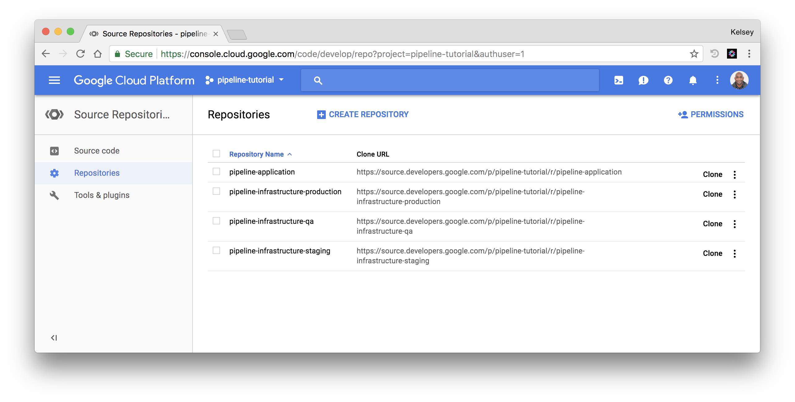

# Setup the GitHub Repositories

In this section you will fork the following GitHub repositories to your own GitHub account:

* [kelseyhightower/pipeline-application](https://github.com/kelseyhightower/pipeline-application)
* [kelseyhightower/pipeline-infrastructure-staging](https://github.com/kelseyhightower/pipeline-infrastructure-staging)
* [kelseyhightower/pipeline-infrastructure-qa](https://github.com/kelseyhightower/pipeline-infrastructure-qa)
* [kelseyhightower/pipeline-infrastructure-production](https://github.com/kelseyhightower/pipeline-infrastructure-production)

Set the list of repository names:

```
REPOS=(
  pipeline-application
  pipeline-infrastructure-staging
  pipeline-infrastructure-qa
  pipeline-infrastructure-production
)
```

Fork the pipeline application and infrastructure repositories:

```
for repo in ${REPOS[@]}; do
  hub clone "https://github.com/kelseyhightower/${repo}.git"
  cd ${repo}/
  hub fork
  cd -
  rm -rf ${repo}
done
```

At this point the pipeline application and infrastructure repositories have been forked to your GitHub account and can used as part of your own deployment pipeline.


## Mirror GitHub Repositories to Cloud Source Repositories

Currently Container Builder only supports build triggers on [Cloud Source Repositories](https://cloud.google.com/source-repositories)(CSR). In this section you will create the Cloud Source Repositories that will mirror each of the GitHub repositories created in the previous section.

Set the list of repository names:

```
REPOS=(
  pipeline-application
  pipeline-infrastructure-staging
  pipeline-infrastructure-qa
  pipeline-infrastructure-production
)
```

For each GitHub repository create a Cloud Source Repository to mirror it, then preform the initial synchronization:

```
for repo in ${REPOS[@]}; do
  gcloud source repos create ${repo}
  git clone --mirror https://github.com/${GITHUB_USERNAME}/${repo}
  git --git-dir ${repo}.git push --mirror \
    --repo "https://source.developers.google.com/p/${PROJECT_ID}/r/${repo}"
  rm -rf ${repo}.git
done
```

At this point the GitHub repositories are mirrored to your Cloud Source Repositories.



To keep the Cloud Source repositories synchronized deploy the [reposync webhook](https://github.com/kelseyhightower/reposync) to your project.

### Deploy the Repo Sync WebHook

In this section you will use [Google Cloud Functions](https://cloud.google.com/functions/) to host the [reposync](https://github.com/kelseyhightower/reposync) webhook used to keep the Cloud Source Repositories in sync with the corresponding GitHub repositories.

Download the `reposync` cloud function:

```
wget https://github.com/kelseyhightower/reposync/releases/download/0.0.1/reposync-cloud-function-0.0.1.zip
```

```
unzip reposync-cloud-function-0.0.1.zip
```

Create a [Google Cloud Storage](https://cloud.google.com/storage) bucket to host the `reposync` cloud function source tree:

```
gsutil mb gs://${PROJECT_ID}-pipeline-functions
```

Deploy the `reposync` cloud function:

```
gcloud beta functions deploy reposync \
  --source reposync-cloud-function-0.0.1 \
  --entry-point F \
  --stage-bucket ${PROJECT_ID}-pipeline-functions \
  --trigger-http
```

## Create the GitHub Webhooks

In this section you will configure each GitHub repository to send [push events](https://developer.github.com/webhooks/#events) to the `reposync` webhook.

Retrieve the `reposync` webhook URL from the Cloud Functions API:

```
WEBHOOK_URL=$(gcloud beta functions describe reposync \
  --format='value(httpsTrigger.url)')
```

Create a webhook configuration payload as defined in the [GitHub Webhooks API guide](https://developer.github.com/v3/repos/hooks/#create-a-hook):

```
cat <<EOF > github-webhook-config.json
{
  "name": "web",
  "active": true,
  "events": [
    "push"
  ],

  "config": {
    "secret": "pipeline",
    "url": "${WEBHOOK_URL}",
    "content_type": "json"
  }
}
EOF
```

Create a wehbook on each pipeline application and infrastructure GitHub repository using the `github-webhook-config.json` webhook configuration payload created in the previous step:

```
export GITHUB_TOKEN=$(cat .pipeline-tutorial-github-api-token)
```

```
for repo in ${REPOS[@]}; do
  curl -X POST "https://api.github.com/repos/${GITHUB_USERNAME}/${repo}/hooks" \
    -H "Content-Type: application/json" \
    -H "Accept: application/vnd.github.v3+json" \
    -u "${GITHUB_USERNAME}:${GITHUB_TOKEN}" \
    --data-binary @github-webhook-config.json
done
```

Each GitHub repositories is now set to send push events to the `reposync` webhook.

Next: [Container Builder Build Triggers](build-triggers.md)
