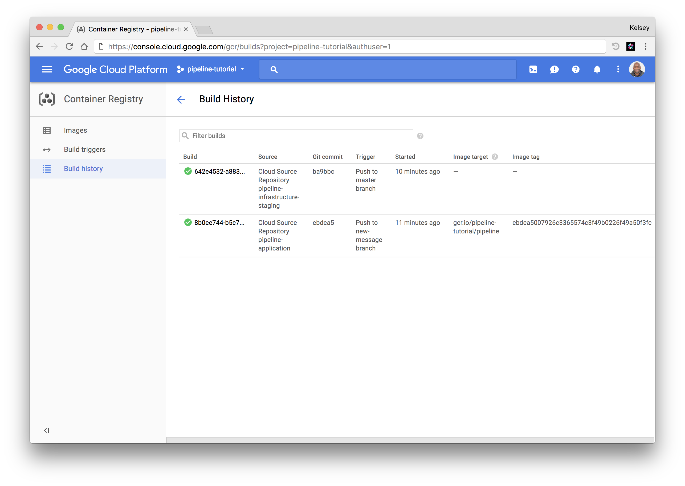
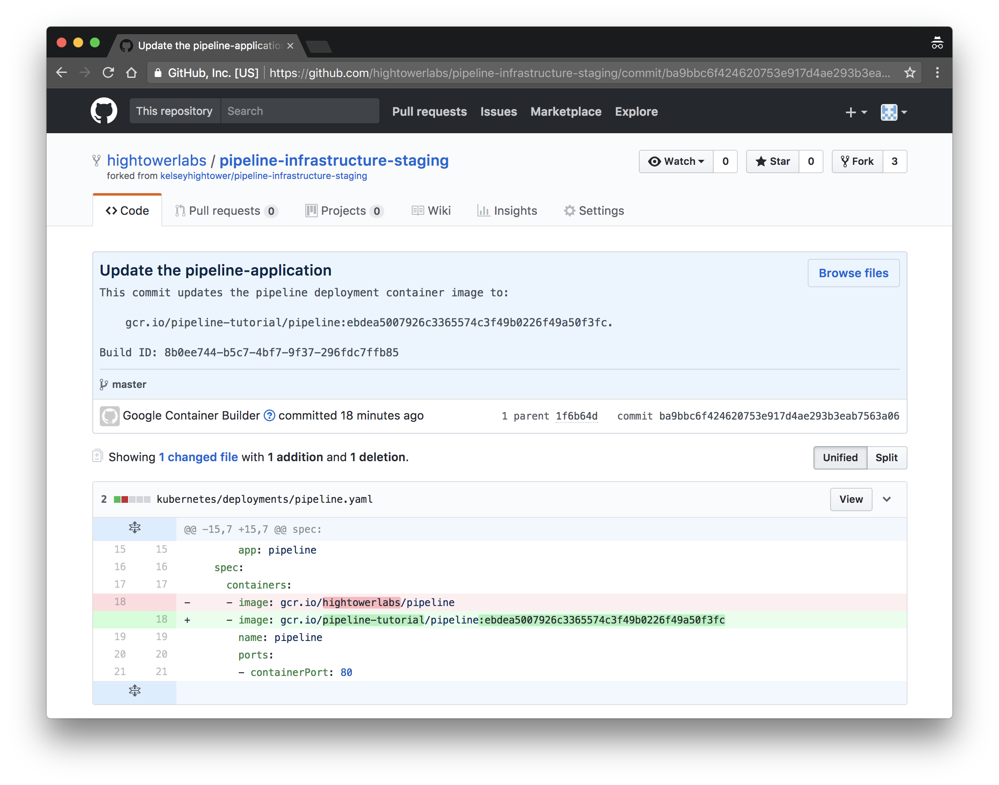
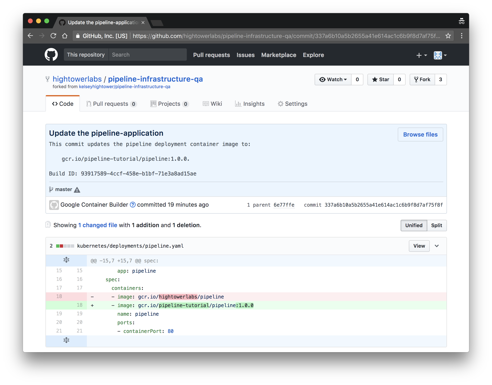
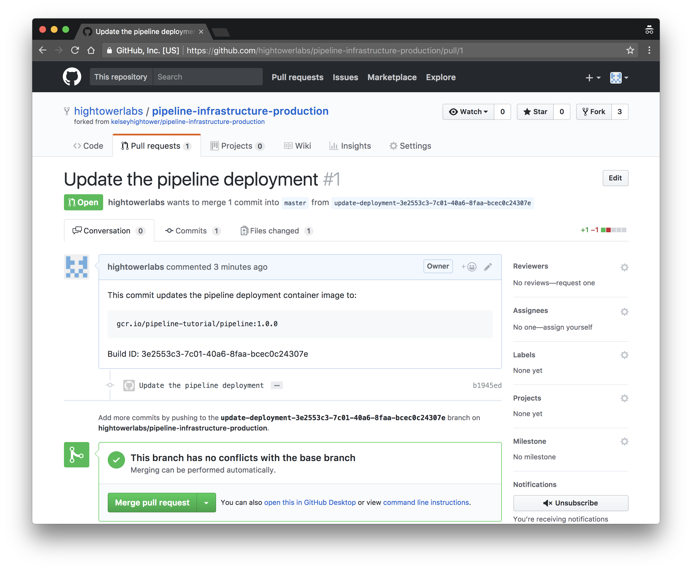
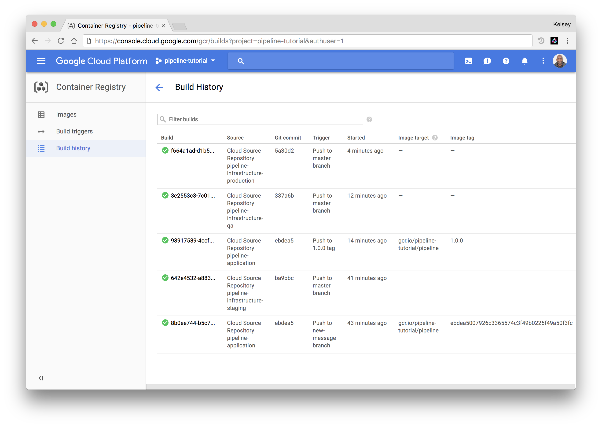

# Test the Pipeline

In this section you will test the Cloud Builder build pipeline by making modifications to the pipeline application and observing how the each change propagates through the staging, qa, and production environments.

## Retrieve the Cluster Credentials

Set the list of environments:

```
ENVIRONMENTS=(
  staging
  qa
  production
)
```

Retrieve the Kubernetes cluster credentials for each environment:

```
for e in ${ENVIRONMENTS[@]}; do
  gcloud container clusters get-credentials ${e}
done
```

Verify no pods are currently running in any environment:

```
for e in ${ENVIRONMENTS[@]}; do
  kubectl get pods --context "gke_${PROJECT_ID}_${COMPUTE_ZONE}_${e}"
done
```

## Modify the Pipeline Application

In this section you will modify the pipeline application and push the changes to a new branch on your pipeline-application GitHub repository.

Configure git to ensure the hub command line utility uses the HTTPS protocol will working with GitHub repositories:

```
git config --global hub.protocol https
```

Configure a git credential helper to use the `hub-credential-helper` utility when authenticating to GitHub:

```
git config --global credential.https://github.com.helper /usr/local/bin/hub-credential-helper
```

Clone the `pipeline-application` GitHub repository to the current directory:

```
hub clone ${GITHUB_USERNAME}/pipeline-application
```

Change into the `pipeline-application` directory and create a new branch named `new-message`:

```
cd pipeline-application
```

```
git checkout -b new-message
```

Modify the message return for HTTP requests to the pipeline application:

```
sed "s/world/${GITHUB_USERNAME}/g" main.go > main.go.new
```

```
mv main.go.new main.go
```

> The syntax for in-place sed updates does not work consistently across operating systems so we are forced to create a temporary file and use it to overwrite the target of our changes.

Review the changes to the pipeline application:

```
git diff
```
```
diff --git a/main.go b/main.go
index 2f76589..0b08a59 100644
--- a/main.go
+++ b/main.go
@@ -21,7 +21,7 @@ func main() {
        log.Println("Starting pipeline application...")

        http.HandleFunc("/", func(w http.ResponseWriter, r *http.Request) {
-               fmt.Fprintf(w, "Hello world!\n")
+               fmt.Fprintf(w, "Hello hightowerlabs!\n")
        })

        http.HandleFunc("/health", func(w http.ResponseWriter, r *http.Request) {
```

Commit the changes and push the `new-message` branch to the `pipeline-application` GitHub repository:

```
git add main.go && git commit -m "change message" && git push origin new-message
```

Pushing a new branch to the `pipeline-application` GitHub repository will trigger the `pipeline-staging-build` build trigger, which will in turn trigger the `pipeline-infrastructure-staging` build trigger:

Review the current builds:

```
gcloud container builds list --limit 2
```
```
ID                                    CREATE_TIME                DURATION  SOURCE                                  IMAGES                                                                      STATUS
642e4532-a883-44ed-b56d-8d98f36ea2a2  2017-11-19T07:37:53+00:00  13S       pipeline-infrastructure-staging@master  -                                                                           SUCCESS
8b0ee744-b5c7-4bf7-9f37-296fdc7ffb85  2017-11-19T07:36:43+00:00  1M4S      pipeline-application@new-message        gcr.io/pipeline-tutorial/pipeline:ebdea5007926c3365574c3f49b0226f49a50f3fc  SUCCESS
```

You can also view the build history using the GCP Console:



List the container images created by the `pipeline-staging-build` build trigger:

```
gcloud container images list-tags gcr.io/${PROJECT_ID}/pipeline
```
```
DIGEST        TAGS                                      TIMESTAMP
e4992a4e2d9c  ebdea5007926c3365574c3f49b0226f49a50f3fc  2017-11-18T23:37:08
```

The `pipeline-staging-build` build trigger pushes a commit to the `pipeline-infrastructure-staging` GitHub repository.



List the pods created by the `pipeline-staging-deployment` build trigger:

```
kubectl get pods \
  --context gke_${PROJECT_ID}_${COMPUTE_ZONE}_staging
```
```
NAME                       READY     STATUS    RESTARTS   AGE
pipeline-389525417-68nxn   1/1       Running   0          1m
```

Verify the changes:

```
SERVICE_IP_ADDRESS=$(kubectl get svc pipeline \
  --context gke_${PROJECT_ID}_${COMPUTE_ZONE}_staging \
  -o jsonpath="{.status.loadBalancer.ingress[0].ip}")
```

```
curl http://${SERVICE_IP_ADDRESS}
```

## Tag the pipeline-application Repo

In this section you will merge the `new-message` and `master` branches, then create a new tag on the `pipeline-application` GitHub repository, which will trigger a new pipeline container image to be built and deployed to the QA Kubernetes cluster.

Checkout the master branch:

```
git checkout master
```

Merge the `new-message` and `master` branches and push the changes to the `pipeline-applicaiton` GitHub repository:

```
git merge new-message && git push origin master
```

Create a new `1.0.0` tag and push it to the `pipeline-applicaiton` GitHub repository:

```
git tag 1.0.0 && git push origin --tags
```

Pushing a new tag to the `pipeline-applicaiton` GitHub repository will trigger the `pipeline-qa-build` build trigger, which will in turn trigger the `pipeline-infrastructure-qa` build trigger.

The `pipeline-qa-build` build trigger pushes a commit to the `pipeline-infrastructure-qa` GitHub repository.



Review the current builds:

```
gcloud container builds list --limit 4
```
```
ID                                    CREATE_TIME                DURATION  SOURCE                                  IMAGES                                                                      STATUS
3e2553c3-7c01-40a6-8faa-bcec0c24307e  2017-11-19T08:06:50+00:00  44S       pipeline-infrastructure-qa@master       -                                                                           SUCCESS
93917589-4ccf-458e-b1bf-71e3a8ad15ae  2017-11-19T08:05:39+00:00  1M7S      pipeline-application@1.0.0              gcr.io/pipeline-tutorial/pipeline:1.0.0                                     SUCCESS
642e4532-a883-44ed-b56d-8d98f36ea2a2  2017-11-19T07:37:53+00:00  13S       pipeline-infrastructure-staging@master  -                                                                           SUCCESS
8b0ee744-b5c7-4bf7-9f37-296fdc7ffb85  2017-11-19T07:36:43+00:00  1M4S      pipeline-application@new-message        gcr.io/pipeline-tutorial/pipeline:ebdea5007926c3365574c3f49b0226f49a50f3fc  SUCCESS
```

List the container images created by the `pipeline-qa-build` build trigger:

```
gcloud container images list-tags gcr.io/${PROJECT_ID}/pipeline
```
```
DIGEST        TAGS                                      TIMESTAMP
fc894ced8191  1.0.0                                     2017-11-19T00:06:05
e4992a4e2d9c  ebdea5007926c3365574c3f49b0226f49a50f3fc  2017-11-18T23:37:08
```

> Notice a new image was created based on the `1.0.0` tag pushed to the `pipeline-application` GitHub repository.

List the pods created by the `pipeline-qa-deployment` build trigger:

```
kubectl get pods \
  --context gke_${PROJECT_ID}_${COMPUTE_ZONE}_qa
```

```
NAME                       READY     STATUS    RESTARTS   AGE
pipeline-685432654-h4zhc   1/1       Running   0          1m
```

Hit the pipeline application in the QA cluster:

```
SERVICE_IP_ADDRESS=$(kubectl get svc pipeline \
  --context gke_${PROJECT_ID}_${COMPUTE_ZONE}_qa \
  -o jsonpath="{.status.loadBalancer.ingress[0].ip}")
```

```
curl http://${SERVICE_IP_ADDRESS}
```

Once the pipeline application is deployed to the QA cluster a pull request is send to the `pipeline-infrastructure-production` GitHub repository. Review and merge the PR on GitHub:



Merging the pull-request on the `pipeline-infrastructure-production` GitHub repository will trigger the `pipeline-production-deployment` build trigger.

```
gcloud container builds list --limit 5
```
```
ID                                    CREATE_TIME                DURATION  SOURCE                                     IMAGES                                                                      STATUS
f664a1ad-d1b5-4897-8d85-faea4197a989  2017-11-19T08:15:03+00:00  13S       pipeline-infrastructure-production@master  -                                                                           SUCCESS
3e2553c3-7c01-40a6-8faa-bcec0c24307e  2017-11-19T08:06:50+00:00  44S       pipeline-infrastructure-qa@master          -                                                                           SUCCESS
93917589-4ccf-458e-b1bf-71e3a8ad15ae  2017-11-19T08:05:39+00:00  1M7S      pipeline-application@1.0.0                 gcr.io/pipeline-tutorial/pipeline:1.0.0                                     SUCCESS
642e4532-a883-44ed-b56d-8d98f36ea2a2  2017-11-19T07:37:53+00:00  13S       pipeline-infrastructure-staging@master     -                                                                           SUCCESS
8b0ee744-b5c7-4bf7-9f37-296fdc7ffb85  2017-11-19T07:36:43+00:00  1M4S      pipeline-application@new-message           gcr.io/pipeline-tutorial/pipeline:ebdea5007926c3365574c3f49b0226f49a50f3fc  SUCCESS
```

List the pods created by the `pipeline-production-deployment` build trigger:

```
kubectl get pods \
  --context gke_${PROJECT_ID}_${COMPUTE_ZONE}_production
```

```
NAME                       READY     STATUS    RESTARTS   AGE
pipeline-685432654-gndw1   1/1       Running   0          35s
```

Hit the pipeline application in the production cluster:

```
SERVICE_IP_ADDRESS=$(kubectl get svc pipeline \
  --context gke_${PROJECT_ID}_${COMPUTE_ZONE}_production \
  -o jsonpath="{.status.loadBalancer.ingress[0].ip}")
```

```
curl http://${SERVICE_IP_ADDRESS}
```

At this point the `pipeline:1.0.0` container image has been propagated across each environment and is now running in the production Kubernetes cluster.


